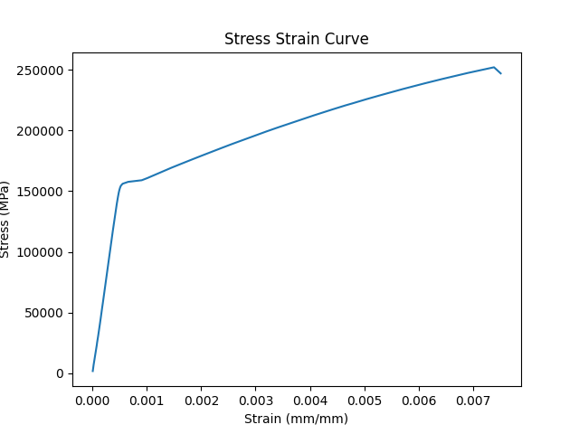

# testing-scientific-code

A repo with example scientific code and software tests to go along with it. Code is in a Jupyter notebook, then refactored into a .py-file. Tests are written and run using pyest.

## Run the code

To run the example scientific code in ```analysis.py```, create a virtual environment with the Python version in ```runtime.txt```. Install the packages in ```requirements.txt```, and run the file. Note the code below assumes you are using conda to create the virtual environment.

```text
conda create -y -n testing-scientific-code python=3.8.5
conda activate testing-scientific-code
python -m pip install -r requirements.txt
python analysis.py
```

The results should be a plot of a tensile test and some information printed out in the console.



```text
Tensile Strength=252.2651604586472
Total Extension=0.0750601755
```

## Run the tests

The purpose of this repo is to demonstrate how to add tests to software created by scientists. The tests in the repo are in the ```tests/``` directory. These tests can be run with pytest.

```text
python -m pytest tests/
```

The results should be that all tests pass. If there are test failures, more information can be gleamed by running pytest in verbose mode.

```text
python -m pytest -v tests/
```
